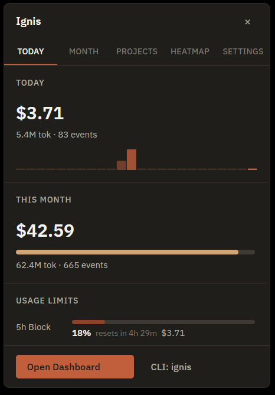
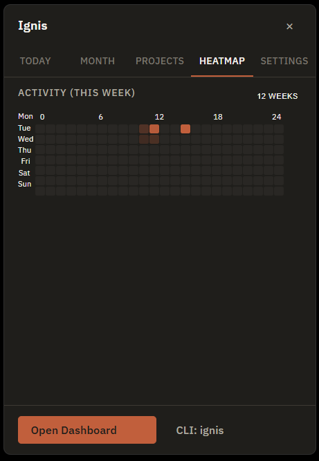
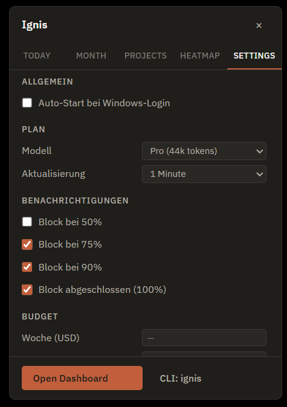

# Ignis

[](https://github.com/jstin-cc/ignis/actions/workflows/ci.yml)
[](LICENSE)

Windows-native local usage tracker for Claude Code. Reads JSONL logs from
`%USERPROFILE%\.claude\projects\` and surfaces token consumption, cost and
session status — entirely local, no cloud, no account.

---

<p align="center">
  
  &nbsp;
  
  &nbsp;
  
</p>

---

## Features

| Interface | What you get |
|-----------|-------------|
| **System-tray app** | Today / Month / Projects / Heatmap / Settings tabs. Spawns the API internally — nothing extra to start. |
| **CLI** (`ignis`) | `daily`, `monthly`, `session`, `scan`, `export` subcommands. Copy-pasteable output. |
| **Local HTTP API** | `127.0.0.1:7337` with Bearer-token auth. Stable `/v1/*` endpoints for statuslines, editor plugins and scripts. |

**Highlights**

- 5-hour billing-block progress bar with configurable alert thresholds (50 / 75 / 90 / 100 %)
- Week × 24 h heatmap with per-hour token intensity
- Budget caps (weekly / monthly USD) with crossing notifications
- Auto-update via GitHub Releases (ed25519-signed manifests)
- First-run wizard; empty-state hint when no JSONL found
- Export to JSON or CSV (`ignis export --format json --output report.json`)

---

## Install

Download the latest NSIS installer from
[**GitHub Releases**](https://github.com/jstin-cc/ignis/releases/latest).

> **SmartScreen notice:** Ignis installers are signed with an ed25519 key for
> the auto-updater but do not yet carry an Authenticode certificate. Windows
> SmartScreen will show a warning on first install. Click **"More info → Run
> anyway"** to proceed. See [ADR-016](DECISIONS.md) for the rationale.

---

## Quick start — development

### Prerequisites

| Tool | Minimum version |
|------|----------------|
| Rust | 1.75 |
| Node | 20 LTS |
| WebView2 | ships with Windows 11 |

```powershell
# Core library + CLI
cargo test                                    # 77 tests, all green
cargo run --bin ignis -- daily                # today's usage

# HTTP API (port 7337)
cargo run --bin ignis-api

# Tray app (hot-reload)
cd tray
npm ci
npm run tauri dev
```

### Release build + installer

```powershell
cd tray
npm ci
npm run tauri build    # MSI + NSIS under tray/src-tauri/target/release/bundle/
```

---

## Configuration

`%APPDATA%\ignis\config.json` — created automatically on first run.

| Key | Default | Description |
|-----|---------|-------------|
| `api_token` | auto-generated | 32-byte hex Bearer token for `/v1/*` |
| `plan` | `max5` | Claude plan (pro / max5 / max20 / custom) |
| `block_alert_thresholds` | `[50,75,90,100]` | % thresholds for block notifications |
| `weekly_budget_usd` | `null` | Optional weekly cost cap |
| `monthly_budget_usd` | `null` | Optional monthly cost cap |
| `auto_start` | `false` | Launch at Windows login |

---

## HTTP API — quick reference

```
GET http://127.0.0.1:7337/health
GET http://127.0.0.1:7337/v1/summary?range=today|week|month|30days|all
GET http://127.0.0.1:7337/v1/sessions?limit=100&active=true
GET http://127.0.0.1:7337/v1/heatmap?granularity=day|hour&range=12weeks|week
GET http://127.0.0.1:7337/v1/burn-rate
```

All `/v1/*` endpoints require `Authorization: Bearer <token>`.
Monetary values are **strings** (not floats) to preserve decimal precision.
Full schema: [`docs/api.md`](docs/api.md).

---

## Status

**v2.0.0 (2026-04-28).** Public release — stable API, CONTRIBUTING, full audit pass.

| Module | State |
|--------|-------|
| Core: `model` · `parser` · `pricing` · `aggregate` · `scanner` · `config` | ✅ |
| `src/provider.rs` — `Provider` trait + `ClaudeCodeProvider` (ADR-012) | ✅ |
| CLI: `ignis daily / monthly / session / scan / export` | ✅ |
| HTTP API: `/health`, `/v1/summary`, `/v1/sessions`, `/v1/heatmap`, `/v1/burn-rate` | ✅ |
| Tray: TabBar (Today / Month / Projects / Heatmap / Settings) | ✅ |
| Tray: Wochen-Heatmap 7×24 h + Today-Sparkline | ✅ |
| Tray: Budget-Schwellen + Notifications | ✅ |
| Tray: First-Run-Wizard + Empty-State | ✅ |
| Tray: Anthropic OAuth usage bars (5 h block / week / extra) | ✅ |
| Tray: Plan settings (Pro / Max5 / Max20 / Custom) | ✅ |
| Tray: Auto-spawns `ignis-api`, port-7337 conflict check | ✅ |
| Tray: Auto-update + Release-Notes + Install button | ✅ |
| Installer (MSI + NSIS via Tauri Bundler) | ✅ |
| CI (Windows runner: fmt + clippy + test) | ✅ |

---

## Architecture

```
ignis (CLI binary)
ignis-api (HTTP API binary, spawned by tray)
├── src/lib.rs          — public API of ignis-core
│   ├── model.rs        — data types
│   ├── parser.rs       — JSONL line parser
│   ├── pricing.rs      — embedded pricing table
│   ├── aggregate.rs    — snapshot builder
│   ├── scanner.rs      — file walker + incremental scan
│   ├── provider.rs     — Provider trait
│   └── config.rs       — config.json I/O
└── src/api.rs          — Axum router

tray/
├── src-tauri/          — Tauri host (Rust)
└── src/                — React 18.3 + TypeScript frontend
```

Key decisions: [`DECISIONS.md`](DECISIONS.md) (ADR-001 – ADR-018).
Full phase breakdown: [`PROGRESS.md`](PROGRESS.md).

---

## Contributing

See [`CONTRIBUTING.md`](CONTRIBUTING.md). By participating you agree to the
[Code of Conduct](CODE_OF_CONDUCT.md).

---

## License

[MIT](LICENSE) © 2026 Justin Strittmatter
